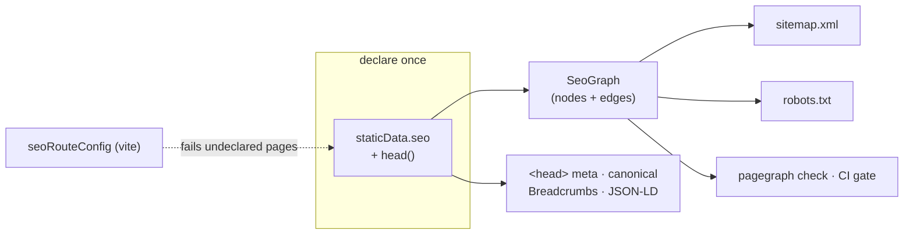

# pagegraph

Route-declared SEO for TanStack Router. Each route declares its SEO policy once, in
`staticData.seo` — the sitemap, `robots.txt`, breadcrumbs, JSON-LD, cross-links, and
the CI check all derive from that one declaration. There is no second place to update,
so nothing drifts. A public page that ships without a declaration **fails the build**.



## Install

```bash
bun add pagegraph
bun add -D lighthouse   # only for `pagegraph audit` performance evidence
```

| Entry                        | Exports                                                                                        | Peers                                       |
| ---------------------------- | ---------------------------------------------------------------------------------------------- | ------------------------------------------- |
| `pagegraph`        | `buildSeoGraph`, `renderSitemap`, `renderRobots`, `contentSignal`, `checkGraph`, `checkRenderedCoverage`, `decodeRenderedEdgeArtifact`, `inspectHtml` | —                                           |
| `pagegraph/react`  | `createSeo` → `seoHead`, `Breadcrumbs`, JSON-LD generators                                     | `react`, `@tanstack/react-router`           |
| `pagegraph/vite`   | `seoRouteConfig` coverage gate                                                                 | `vite`                                      |
| `pagegraph/config` | `defineSeoConfig`, `viteGraphLoader`                                                           | `vite`                                      |
| `pagegraph/audit`  | Audit services, scanner protocol, rules, and report schemas                                    | `effect`                                    |
| `pagegraph` bin                   | CLI over the same graph                                                                        | bundled — runs on Bun                        |

The core and React entries have **zero runtime dependencies** — everything above is a
peer, and only the entries you import need theirs installed.

The CLI **bundles Effect and the TypeSafe provider**, so it needs no Effect peers and does not
depend on the app's Effect RC; it runs on [Bun](https://bun.sh) (`bunx pagegraph`). `vite` stays a
peer — the graph commands load your app through Vite at runtime — and `lighthouse` is only needed by
`pagegraph audit`. Importing `pagegraph/audit` programmatically still needs `effect`.

## Quick start

**1. Bind your site identity once.** Route files never see an origin or a brand name.

```ts
// lib/seo.ts
import { createSeo } from "pagegraph/react";

export const { seoHead } = createSeo({
  origin: "https://example.com",
  site: {
    name: "Example",
    logo: "/logo.png",
    publisherLogo: "/publisher.png",
    defaultImage: "/og.png",
    defaultAuthor: { name: "Example Team" },
  },
  organization: {
    legalName: "Example, Inc.",
    description: "What the company does.",
    sameAs: ["https://github.com/example"],
    contactPoint: { contactType: "support", email: "hi@example.com" },
    address: {
      streetAddress: "123 Example Street",
      addressLocality: "Example City",
      addressRegion: "CA",
      postalCode: "94105",
      addressCountry: "US",
    },
  },
  website: { searchPath: "/docs?q={search_term_string}" },
});
```

**2. Declare on the route.** Policy in `staticData.seo`, per-page content in `head()`.

```tsx
export const Route = createFileRoute("/pricing")({
  staticData: {
    seo: {
      kind: "page",
      crumb: "Pricing",
      sitemap: { priority: 0.9, changeFrequency: "weekly" },
      related: ["/features", "/docs"],
      link: { title: "Pricing", description: "Simple volume pricing." },
    },
  },
  head: (ctx) =>
    seoHead(ctx, {
      title: "Pricing — Example",
      description: "Simple volume pricing.",
    }),
});
```

`seoHead` returns the `meta` + canonical `links` TanStack renders into `<head>` —
title, description, og/twitter cards, robots, and the JSON-LD each page warrants
(BreadcrumbList always; Article, FAQPage, Service, ItemList when the instance
declares them).

### Extensible JSON-LD

The built-in generators are conveniences, not a closed schema registry. Define any
`schema-dts` entity, link it to the plugin's stable site identities, and compose one
site graph:

```ts
import {
  createSeo,
  defineJsonLd,
  extendJsonLd,
  jsonLdRef,
} from "pagegraph/react";

export const seo = createSeo({
  // site, organization, and website as above
  jsonLd: {
    site: (ids) => [
      defineJsonLd({
        "@type": "SoftwareApplication",
        "@id": "https://example.com/#product",
        name: "Example",
        applicationCategory: "DeveloperApplication",
        operatingSystem: "Web",
        provider: jsonLdRef(ids.organization),
      }),
    ],
    transform: (entry) => {
      if (entry.kind === "organization") {
        return extendJsonLd(entry.document, {
          slogan: "Ship with confidence.",
        });
      }
      return entry.document;
    },
  },
});

const siteGraph = seo.generateSiteGraphSchema();
```

`generateSiteGraphSchema()` includes Organization, WebSite, and configured site
entities in one `@graph`. Organization and WebSite use stable `#organization` and
`#website` IDs; articles and services provided by the site reference the same
Organization. Existing individual generators remain available and are not transformed.

Add page-specific entities through `seoHead`:

```ts
head: (ctx) =>
  seo.seoHead(ctx, {
    title: "Example for developers",
    description: "A focused description of the product.",
    jsonLd: [
      defineJsonLd({
        "@type": "SoftwareApplication",
        name: "Example",
        url: "https://example.com/product",
      }),
    ],
  });
```

The transform sees discriminated generated and custom entries plus `origin`,
`canonical`, and `entityIds`. Return the document to keep it, no value (or `false`)
to suppress it, or an array to expand it. Output preserves caller order and never
silently deduplicates entities.

**3. Serve the projections.** Build the graph from your route tree, render strings.

```ts
// lib/seo/graph.ts — also the module the CLI loads
import { buildSeoGraph } from "pagegraph";

export const loadSeoGraph = () =>
  buildSeoGraph({ routeTree, collections: [blogCollection] });
```

```ts
// routes/sitemap[.]xml.ts — robots[.]txt.ts is symmetric
import { renderRobots, renderSitemap } from "pagegraph";

renderSitemap(loadSeoGraph(), { origin, indexable: true });
renderRobots(loadSeoGraph(), {
  origin,
  indexable: true,
  disallow: routeConfig.robotsExclusions,
  contentSignal: "search=yes, ai-input=yes, ai-train=yes",
});
```

`renderRobots` does not invent a Content-Signal. Pass `contentSignal` for
the value (the plugin prefixes `Content-Signal: `), `directives` for extra
group lines, and `transform` if you need to wrap or replace the whole file.
Preview hosts (`indexable: false`) drop `contentSignal` and `directives`;
`transform` still runs.

**4. Gate CI.** The same graph, the same rules, exit 1 on structural violations.

```bash
pagegraph check
```

## Typed paths

Augment `Register` (the same pattern TanStack Router uses) and `related` /
`redirectTo` are typed against your real route tree — a renamed route becomes a
compile error, not a dead link:

```ts
declare module "pagegraph" {
  interface Register {
    paths: FileRouteTypes["fullPaths"];
    kinds: "page" | "article" | "hub";
  }
}
```

## The graph

`buildSeoGraph` walks the route tree and produces nodes (one per public URL) and
typed edges: `crumb-parent` (breadcrumb ancestry), `related` (deliberate
cross-links), `redirect`, and `collection-member`.

Dynamic pages — blog posts rendering through `/blog/$slug` — enter as
**collections**. Instances inherit the param route's declared policy, so
declarations stay the single source of truth:

```ts
const blogCollection: SeoCollection = {
  route: "/blog/$slug",
  source: "blog",
  instances: posts.map((p) => ({
    path: `/blog/${p.slug}`,
    title: p.title,
    description: p.description,
    publishedAt: p.date,
  })),
};
```

`checkGraph` runs every rule against the graph and returns violations at two
severities:

- **structural** — internally broken declarations; these fail `pagegraph check` (exit 1):
  dead or duplicate edges, path collisions, a redirect in the sitemap, a
  sitemap/noindex contradiction, a `related` target with no `link` card, an
  instance without a title, or an unmet contextual-link coverage rule.
- **editorial** — quality smells, reported but non-failing: duplicate or mis-sized
  titles and descriptions.

## Coverage gate (Vite)

`seoRouteConfig` parses the route tree with `@tanstack/router-generator` (the same
parser as the router) and fails `vite build` when a page in an enforced group has
neither `staticData` nor `head`:

```ts
// vite.config.ts
import { seoRouteConfig } from "pagegraph/vite";

seoRouteConfig({
  outputPath: fileURLToPath(new URL("./lib/route-config.ts", import.meta.url)),
  publicGroups: ["(marketing)", "(docs)"],
  enforceCoverageIn: ["(marketing)", "(docs)"],
  alwaysDisallow: ["/dashboard", "/api"],
});
```

It also derives a small config module from the route tree: `robotsExclusions`
(feed to `renderRobots`) and `reservedSegments` (top-level segments an app must
not hand out as tenant/org slugs).

## CLI

The graph commands acquire your graph through `seo.config.ts` at the app root —
the `viteGraphLoader` evaluates your graph module inside a headless Vite server,
so path aliases, content plugins, and virtual modules all resolve:

```ts
// seo.config.ts
import { defineSeoConfig, viteGraphLoader } from "pagegraph/config";

export default defineSeoConfig({
  origin: "https://example.com",
  disallow: routeConfig.robotsExclusions,
  contentSignal: "search=yes, ai-input=yes, ai-train=yes",
  // Fail `check` unless each named money page has enough contextual links.
  coverage: [{ path: "/pricing", minInbound: 2 }, { path: "/features/*", minInbound: 1 }],
  loadGraph: viteGraphLoader({
    root: import.meta.dirname,
    entry: "/lib/seo/graph.ts",
    exportName: "loadSeoGraph",
  }),
});
```

```bash
pagegraph check                 # CI gate — exit 1 on structural violations
pagegraph graph                 # the graph as a tree · --format mermaid | json
pagegraph inspect /pricing      # one node: policy, sitemap status, in/out edges
pagegraph inspect <url> --live  # fetch a deployed page, validate its rendered <head>
pagegraph links verify <url>    # crawl served HTML: depth, orphans, declared-vs-rendered
pagegraph links verify <url> --assert-coverage  # also assert seo.config.ts coverage on served anchors
pagegraph links verify <url> --emit-rendered <file>  # save the rendered edge set
pagegraph links candidates      # propose contextual links from the declared graph
pagegraph links decide <file>   # answer typed link questions with Jev (TYPESAFE_API_KEY)
pagegraph decide <family> [<file>]  # answer a decision batch with Jev (TYPESAFE_API_KEY)
pagegraph sitemap               # print sitemap.xml
pagegraph robots                # print robots.txt
```

Stdout is data, stderr is status — `pagegraph check --json | jq` just works.

### Verify the rendered link graph

`pagegraph links verify` crawls a site's served HTML — through the same DNS-pinned,
private-IP-blocked HTTP path as `pagegraph audit` — and reports what a crawler
actually receives: the real homepage depth, the pages with no incoming internal
edge (rendered orphans), and, when the app has a `seo.config.ts`, the
declared-vs-rendered link diff. It is bounded with `--limit` and needs no
framework or config:

```bash
pagegraph links verify https://example.com
pagegraph links verify https://example.com --limit 25 --json | jq
```

`--emit-rendered <path>` writes the crawl's raw edge set as a versioned artifact,
and `--rendered <path>` replays one instead of crawling — so a single crawl can be
asserted repeatedly in CI without re-fetching:

```bash
pagegraph links verify https://example.com --emit-rendered .seo/rendered.json
pagegraph links verify --rendered .seo/rendered.json --json | jq
```

The artifact preserves every anchor's `region` (`body` vs `nav`/`footer`/`header`)
and the provenance a gate needs to trust it:

```jsonc
{
  "kind": "links-rendered",
  "schemaVersion": 1,
  "origin": "https://example.com",
  "seed": "https://example.com/",
  "crawl": {
    "pages": 42,
    "root": "/",
    "limit": 100,
    "truncated": false,
    "bodyTruncated": false,
    "truncatedPages": [],
    "failures": [],
  },
  "nodes": ["/", "/pricing"],
  "edges": [{ "from": "/", "to": "/pricing", "region": "body" }],
}
```

It is also a drop-in input for `pagegraph links candidates --rendered`.

### Assert coverage on the rendered graph

`pagegraph check` evaluates the `seo.config.ts` `coverage` rules against the
**declared** graph; `pagegraph links verify --assert-coverage` evaluates the same
rules against the anchors a crawler **actually receives**. Only same-origin
body-region anchors count — nav, header, and footer links are chrome — which is
the served analogue of `check` counting `related` edges alone. The rule's target
universe is still the declared graph's sitemap-eligible pages.

```bash
pagegraph links verify https://example.com --assert-coverage
pagegraph links verify --rendered .seo/rendered.json --assert-coverage --json | jq
```

The command exits non-zero when any rule is unmet, and **refuses to assert** (also
non-zero) rather than reporting a false pass when the crawl outran `--limit`, a
page failed to fetch (its anchors are missing), a body hit `--max-body-bytes`, the
config declares no `coverage`, or the artifact's origin differs from
`seo.config.ts`. Under `--assert-coverage` the report gains a `coverage` block
(`{ rules, ok, violations }`); the default `--json` summary is unchanged.

### Propose contextual links

`pagegraph links candidates` reads the declared graph and proposes
`(source, destination)` pairs that are plausible contextual links and not already
connected. Pages are grouped into clusters — a shared top-level section, or the
same `kind` for root-level pages — and only sitemap-eligible pages are proposed.
Pairs already declared as a `related` edge are excluded, and `--rendered` accepts
a JSON dump of already-served anchors (`[{ from, to }]` or `{ edges: [...] }`) to
exclude those too.

The output is a reviewable plan: human text by default, versioned JSON with
`--json`. Nothing is applied. `--limit` and `--cluster` bound the plan, and
`--decide` optionally hands the candidates to Jev for a recommendation and
confidence per pair (requires `TYPESAFE_API_KEY`):

```bash
pagegraph links candidates
pagegraph links candidates --cluster blog --limit 20
pagegraph links candidates --rendered rendered.json --json | jq
pagegraph links candidates --decide
```

### Decide with Jev

`pagegraph links decide` answers four decisions per candidate — *does the source have a genuine
reason to link to the destination?*, *is descriptive anchor text already in the copy?*, *which
direction deserves the link?*, and *how relevant is it?* — and routes anything inside the confidence
band `(1−t, t)` to a `review` bucket instead of auto-applying. `--budget` (default 4) keeps only the
top-K candidates per source by relevance.

```bash
pagegraph links decide candidates.json --threshold 0.9
pagegraph links decide candidates.json --budget 2 --json | jq
cat candidates.json | pagegraph links decide
```

Decisions run through [Jev](https://typesafe.ai) via `@effect/ai-typesafe` (model `jev-latest`),
bundled into the CLI. The API key is read from the **`TYPESAFE_API_KEY` environment variable** — it
is deliberately not a `seo.config.ts` field, so keys never live in the repo; `seo.config.ts` carries
non-secret decision settings only. Without a key the command exits 1 with a clear message and an
empty stdout.

### The decision runner

`pagegraph decide <family>` generalizes Jev decisions over a batch. Each input answers every decision
for that input in one provider call; confident answers resolve and anything inside the confidence
band goes to a `review` bucket. Nothing is applied automatically — the report is the end product.

```bash
pagegraph decide <family> inputs.json --json | jq
cat inputs.json | pagegraph decide <family> --threshold 0.9
```

A batch is a JSON array, a `{ "inputs": [...] }` envelope, or JSONL (one input per line), from a file
argument or stdin. Flags are shared across families:

| Flag              | Default     | Meaning                                                       |
| ----------------- | ----------- | ------------------------------------------------------------- |
| `--json`          | false       | Emit the versioned report as JSON on stdout                    |
| `--model <id>`    | `jev-latest` | TypeSafe System One model (`jev-latest`, `jev-preview`, …)     |
| `--threshold <t>` | `0.7`       | Confidence boundary; `(1−t, t)` is the review band             |
| `--concurrency <n>` | `4`       | In-flight decision calls                                       |
| `--cache <dir>`   | —           | Reuse model answers by family + model + input hash             |
| `--review-out <file>` | —       | Write only the below-threshold records to JSON                 |

`pagegraph decide links` is the links family alias of `pagegraph links decide` (see
[Decide with Jev](#decide-with-jev)); it accepts the same candidate array.

#### `decide serp` — is our page the shape this SERP rewards?

Input: one saved results-page snapshot per input.

```json
{
  "query": "best email api",
  "ourPage": {
    "url": "https://example.com/email-api",
    "title": "Email API for developers",
    "kind": "page",
    "firstWords": "Send transactional email from your product."
  },
  "serpItems": [
    { "type": "organic", "rank": 1, "domain": "a.example", "title": "Best email APIs", "snippet": "Compare" }
  ]
}
```

| Verdict    | Meaning                                                            |
| ---------- | ------------------------------------------------------------------ |
| `aligned`  | Intent and format are both confidently positive.                   |
| `mismatch` | At least one of intent/format is confidently wrong.                |
| `review`   | Any answer (`ourFormatFit`, `intentMatch`, `titlePatternMatch`) is inside the band. |

#### `decide content` — does this page carry enough substance?

Input: one page per input, with the evidence the rubric reads.

```json
{
  "url": "https://example.com/email-api",
  "query": "best email api",
  "title": "Transactional email API for product teams",
  "h1": "Send transactional email",
  "first150Words": "The API sends one message per call and reports delivery events.",
  "headings": ["Quickstart", "Events", "Pricing"],
  "wordCount": 1200,
  "structuredData": ["Article", "FAQPage"],
  "categoryLock": "email api",
  "siblingIntents": ["email deliverability", "sms api"],
  "competitorExcerpts": ["A competitor's overview."]
}
```

| Verdict  | Meaning                                                                     |
| -------- | --------------------------------------------------------------------------- |
| `pass`   | The value rating is not `thin` and no rubric probability is confidently false. |
| `flag`   | Value is `thin`, or a rubric probability (`originalValue`, `answersFirst`, …) is confidently false. |
| `review` | Any rubric or value probability is inside the band, or an evidence-dependent rubric (`distinctIntent`, `competitiveSubstance`) is confidently positive without `siblingIntents`/`competitorExcerpts`. |

`wordCount` must be a non-negative integer.

`value` rates `thin | adequate | strong`.

#### `decide fit` — which existing page should target this query?

Input: a query plus the site's candidate pages. Candidate ids become the provider labels, so the
family needs at least two candidates with unique ids of at most 255 characters.

```json
{
  "query": "best email api",
  "candidates": [
    { "id": "/email-api", "title": "Email API", "excerpt": "Send transactional email." },
    { "id": "/pricing", "title": "Pricing", "excerpt": "Volume pricing." }
  ]
}
```

| Verdict        | Meaning                                                  |
| -------------- | -------------------------------------------------------- |
| `map`          | A page is confidently best; update it.                    |
| `cannibalized` | Multiple pages already target the query.                  |
| `gap`          | No page can serve the query; a new page is needed.        |
| `review`       | The conflict or the best page is inside the confidence band. |

#### `decide meta` — rank supplied title/description candidates

Input: a page plus the candidates to rank. Drafting is out of scope — only the provided candidates
are judged. Needs at least two candidates with unique ids of at most 255 characters.

```json
{
  "url": "https://example.com/email-api",
  "intent": "choose an email api",
  "categoryLock": "email api",
  "candidates": [
    { "id": "a", "title": "Email API", "description": "Send transactional email." },
    { "id": "b", "title": "Email pricing", "description": "Volume pricing." }
  ]
}
```

| Verdict       | Meaning                                                                   |
| ------------- | ------------------------------------------------------------------------- |
| `choose:<id>` | A candidate is confidently best with clear intent, length, category, and clickbait checks. |
| `review`      | A concern or an uncertain pick; a human decides.                           |

#### `decide authority` — is this a real link opportunity?

Input: one link target per input.

```json
{
  "domain": "blog.example",
  "url": "https://blog.example/email-guide",
  "anchor": "transactional email API",
  "context": "We cover how a transactional email API works end to end.",
  "targetPath": "/email-api",
  "rd": 120,
  "signals": ["editorial", "no-outbound-links"]
}
```

| Verdict  | Meaning                                                                  |
| -------- | ------------------------------------------------------------------------ |
| `accept` | Legitimate, outreach-worthy, and a confident non-`none` fit.              |
| `spam`   | Spam is confidently high.                                                |
| `review` | Any probability is inside the band, or the fit is `none`/uncertain.       |

`fit` classifies `directory | partner | editorial | community | none`.

#### `decide links` — direction, relevance, and budget

`pagegraph decide links` shares the links decisions (see [Decide with Jev](#decide-with-jev)) and
adds `--budget <n>` (default 4): keep the top-K candidates per outbound page by `relevance`
(`irrelevant | useful | essential`). `direction` classifies `a_to_b | b_to_a | both`; a record also
carries the resulting `from`/`to` endpoints, so a `b_to_a` recommendation is reported — and
budgeted — against the page the model actually chose to link *from*.

### Contextual-link coverage

Declare a contextual-link coverage policy in `seo.config.ts` (a `coverage` array
of `{ path, minInbound }`), or pass repeatable `--require-inbound "<path-glob>=<n>"`
flags to override it for one run. `pagegraph check` then fails (exit 1) unless
every sitemap-eligible page matching the glob has at least `minInbound` incoming
`related` edges. `*` matches within a path segment and `**` crosses segments; a
rule that matches no sitemap-eligible page is itself a violation.

```bash
pagegraph check --require-inbound "/pricing=2" --require-inbound "/features/*=1"
```

`pagegraph check` asserts the policy on the declared graph. To prove the links are
actually served, assert the same policy on the rendered graph — see
[Assert coverage on the rendered graph](#assert-coverage-on-the-rendered-graph).

### Audit any website

`pagegraph audit` is framework-independent and does not need `seo.config.ts`. It
validates target URLs before making requests, follows redirects through the same
validation boundary, inspects the rendered document and discovery files, and
can collect Lighthouse evidence through a validating proxy.

```bash
pagegraph audit https://example.com
pagegraph audit https://example.com https://example.com/docs --json | jq
pagegraph audit https://localhost:3000 --allow-private --probe-only
```

The report keeps evidence and findings separate: scanners collect observations;
pure rules classify structural failures and editorial quality issues. One failed
scanner does not erase successful evidence from the others. JSON mode emits one
versioned document on stdout, while diagnostics and artifact paths stay on
stderr.

Use `--probe-only` when Lighthouse is unavailable or unnecessary. Private and
reserved destinations are rejected unless `--allow-private` is explicit; that
flag is intended for local development and CI fixtures.

### Compare audit artifacts

Write timestamped reports from two revisions, then compare their semantic SEO
outcomes without failing on timestamps, timing, or other raw scanner evidence:

```bash
pagegraph audit https://example.com --output-dir .audit/before
# deploy or check out the next revision
pagegraph audit https://example.com --output-dir .audit/after
pagegraph diff .audit/before/<report>.json .audit/after/<report>.json
pagegraph diff .audit/before/<report>.json .audit/after/<report>.json --json | jq
```

| Change | Outcome | Exit |
| --- | --- | ---: |
| Timestamp, warning text, or raw scanner evidence only | `unchanged` | 0 |
| Editorial finding or improvement | `changed` | 0 |
| Structural finding, scanner degradation, or lost coverage | `regressed` | 1 |

Inputs must satisfy the published `AuditReport` schema version 1. JSON mode
emits a separately versioned `audit-diff` document even when a regression makes
the command exit 1; operational and schema failures write only to stderr.

Raw scanner evidence remains in the source artifacts but is not interpreted by
the generic comparator. Performance gates should be expressed as scanner
findings with explicit thresholds rather than inferred from volatile Lighthouse
measurements. Finding payloads (`message`, `fix`, `observed`, and `expected`)
remain semantic: same-severity changes are reported as non-blocking `changed`
outcomes.

## Testing

Everything the CLI checks is a pure function you can call from a test:

```ts
import {
  checkGraph,
  hasStructuralViolations,
  inspectHtml,
} from "pagegraph";

expect(hasStructuralViolations(checkGraph(loadSeoGraph()))).toBe(false);

// render a page however you like, then assert the head it actually ships
const report = inspectHtml(url, 200, html);
expect(report.issues).toEqual([]);
```

## TanStack Start example

The [TanStack Start cookbook](./examples/tanstack-start/README.md) shows the complete wiring in
one place: route-declared metadata, the graph loader, sitemap and robots projections, JSON-LD,
the Vite coverage gate, and the CLI inspection and `pagegraph diff` workflow. It is intentionally
framework-neutral beyond the Start route seams, so you can copy the modules into an existing
Start app and keep your own route tree and content collections.

## License

MIT
